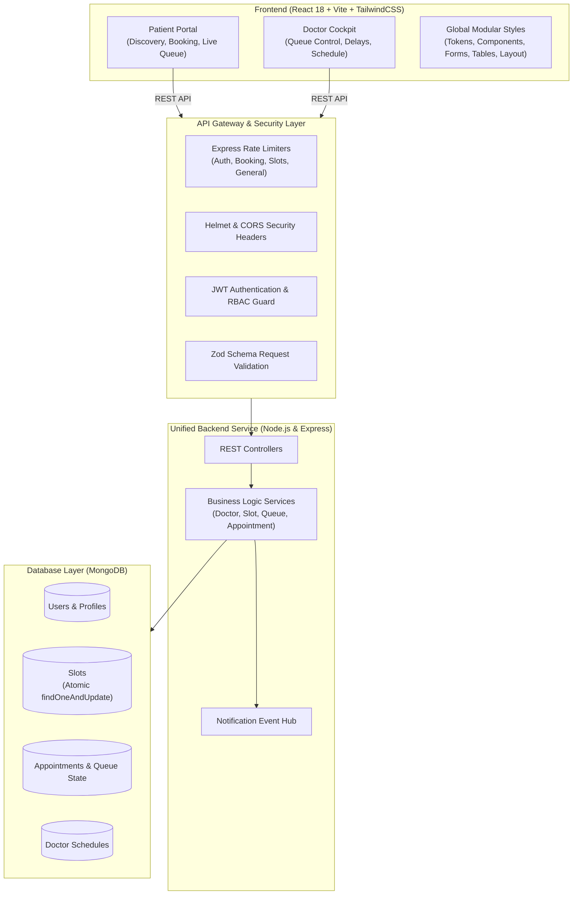

<div align="center">

# 🩺 MedPulse · Medical Portal
### Real-Time Doctor Availability, Appointment Scheduling & Live Clinic Queue System

[](https://www.typescriptlang.org/)
[](https://reactjs.org/)
[](https://nodejs.org/)
[](https://expressjs.com/)
[](https://www.mongodb.com/)
[](https://tailwindcss.com/)
[](https://vitejs.dev/)
[](https://github.com/Krinz-hub/medical-portal-)

<p align="center">
  <b>A unified, production-grade healthcare platform eliminating clinic waiting room delays through atomic slot scheduling, live queue tracking, and real-time doctor status broadcasting.</b>
</p>

[Key Features](#-key-features) •
[Architecture](#-system-architecture) •
[UI Design System](#-anti-ai-ui-design-system) •
[Quick Start](#-quick-start-guide) •
[Demo Accounts](#-ready-to-use-demo-accounts) •
[Concurrency & Tests](#-testing--verification) •
[API Docs](#-api-endpoints-reference)

</div>

---

## 📌 Problem & Solution

> **The Healthcare Bottleneck:**
> Patients often commute to clinics without knowing if their doctor is available, on emergency rounds, or running hours behind schedule. This causes crowded waiting rooms, cross-infection risks, and wasted hours.

**MedPulse** solves this with a **single source of truth** architecture:
- **For Patients:** Direct slot booking with atomic concurrency locks, real-time consultation token tracking, and dynamically recalculated wait times that account for doctor delays.
- **For Doctors:** A real-time clinical practice cockpit to broadcast status (`Available`, `Delayed`, `On Break`), manage queue stages (`Check-In` $\to$ `In Consultation` $\to$ `Completed`), configure weekly recurring schedules, and auto-generate appointment slots.

---

## ✨ Key Features

### 👨‍⚕️ Doctor Operational Cockpit
- **Live Practice Status & Delay Broadcasting**: Switch between `AVAILABLE`, `DELAYED`, `ON_BREAK`, and `BUSY`. Set delay in minutes (e.g. `25m`) to automatically notify patients and adjust their estimated consultation times.
- **Patient Queue Management**: View today's patient queue ordered by time and token number. Progress appointments in 1 click:
  $$\text{CONFIRMED} \longrightarrow \text{CHECKED\_IN} \longrightarrow \text{IN\_PROGRESS} \longrightarrow \text{COMPLETED} \ (\text{or } \text{NO\_SHOW})$$
- **Automated Slot Generation Engine**: Configure weekly operating schedules per day (start time, end time, slot interval) and auto-generate open slots for up to 4 weeks in advance.
- **Emergency Slot Blocking**: Instantly block or unblock specific time slots for emergency rounds, personal leave, or administrative breaks.
- **Practice Analytics**: Live visibility into total visits, daily patient counts, average wait duration, and completion rates.

### 🧑‍💼 Patient Care Portal
- **Specialist Discovery**: Filter verified physicians by specialty (Cardiology, Dermatology, Pediatrics, Neurology, General Medicine), fee range, and today's open availability.
- **Conflict-Free Atomic Booking**: Direct slot booking protected against double bookings through atomic database operations.
- **Live Queue & Token Tracker**: Real-time token monitoring displaying current patient in consultation, personal token number, patients ahead in line, and estimated wait minutes.
- **Self-Service Appointment Control**: Seamless 1-click slot rescheduling with atomic reservation swap, or cancellation with immediate slot release.

---

## 🏗 System Architecture

The platform operates on **ONE unified backend** and **ONE shared MongoDB database**, ensuring complete synchronization across patient and doctor interfaces.



---

## 🎨 Anti-AI UI Design System

Built under strict clinical design principles to eliminate generic "AI-website builder" aesthetics (neon gradients, giant pill buttons, arbitrary `rounded-3xl` radii, floating blur spheres, and decorative emojis):

* **Color Palette**: Clinical Teal primary (`#0f766e`), deep Slate typography (`#0f172a`), calm status indicators (`Emerald` for available, `Amber` for delays, `Rose` for cancellations).
* **Consistent Border Radii**:
  - Small controls (chips, status badges): `rounded-md` (4–8px)
  - Inputs, selects, and action buttons: `rounded-lg` (6–10px)
  - Cards, panels, tables, and modal dialogs: `rounded-xl` (10–16px)
* **Modular Global Styles Architecture**:
  All styling is centralized in `frontend/src/styles/` with zero redundant inline style dictionaries:
  - [`tokens.css`](file:///Users/dev/Desktop/build%20athon/frontend/src/styles/tokens.css): CSS design tokens, colors, radii, and typography scales.
  - [`components.css`](file:///Users/dev/Desktop/build%20athon/frontend/src/styles/components.css): Global `.btn`, `.card-clinical`, `.badge-clinical`, `.modal-panel`.
  - [`forms.css`](file:///Users/dev/Desktop/build%20athon/frontend/src/styles/forms.css): Unified `.form-group`, `.form-label`, `.form-input`, `.form-select`, `.segmented-control`.
  - [`tables.css`](file:///Users/dev/Desktop/build%20athon/frontend/src/styles/tables.css): High-density `.table-clinical`, `.th-clinical`, `.td-clinical`, `.tr-active`.
  - [`layout.css`](file:///Users/dev/Desktop/build%20athon/frontend/src/styles/layout.css): Standard `.page-container`, `.page-header`, `.alert-banner-*`.

---

## 🔒 Security & Concurrency Hardening

### 1. Atomic Double-Booking Lock
Eliminates race conditions when multiple patients attempt to book the exact same slot concurrently:
```typescript
// Atomic MongoDB operation prevents concurrent double-booking
const slot = await Slot.findOneAndUpdate(
  { _id: slotId, status: 'AVAILABLE' },
  { $set: { status: 'BOOKED' } },
  { new: true, session }
);

if (!slot) {
  throw new AppError('This slot was just booked by another patient. Please select another time.', 409);
}
```

### 2. Multi-Tiered Rate Limiting
Configured via `express-rate-limit` with proper headers (`RateLimit-Limit`, `RateLimit-Remaining`, `RateLimit-Reset`):
- **Auth Limiter**: 25 attempts per 15 minutes (`/api/auth/login`, `/api/auth/register`) to prevent brute-force attacks.
- **Booking Limiter**: 30 booking requests per 10 minutes (`/api/appointments`) to prevent slot hoarding scripts.
- **Slot Generation Limiter**: 15 batch generation requests per 10 minutes (`/api/doctor/slots/generate`).
- **General API Limiter**: 600 requests per 15-minute window for standard queries.

---

## 🚀 Quick Start Guide

### Prerequisites
- **Node.js**: v18.0.0 or higher (v20+ recommended)
- **npm**: v9.0.0 or higher
- **MongoDB**: Local MongoDB instance OR the automated built-in embedded MongoMemoryServer (zero setup required).

### 1. Clone the Repository
```bash
git clone https://github.com/Krinz-hub/medical-portal-.git
cd medical-portal-
```

### 2. Backend Setup
```bash
cd backend
npm install

# Copy environment variables
cp .env.example .env

# Seed initial database with realistic doctors & active slots
npm run seed

# Start backend server (starts on http://localhost:5001)
npm run dev
```

> **Note on MongoDB:** If `MONGODB_URI` is not specified in `.env`, the backend automatically launches a persistent, embedded in-memory MongoDB instance. No local database installation required!

### 3. Frontend Setup
```bash
# In a new terminal window:
cd frontend
npm install

# Start Vite development server (starts on http://localhost:5173)
npm run dev
```

Visit **`http://localhost:5173`** in your browser.

---

## 🔑 Ready-to-Use Demo Accounts

The database seed initializes verified Indian Medical Council doctors and patients with pre-generated slots:

| Role | Email | Password | Details |
| :--- | :--- | :--- | :--- |
| **Doctor** | `dr.sharma@healthhub.com` | `Password123!` | Dr. Ananya Sharma · Cardiologist · City Care Hospital |
| **Doctor** | `dr.vikram@healthhub.com` | `Password123!` | Dr. Vikram Patel · Neurologist · Apex Neuro Clinic |
| **Patient** | `rahul.patient@gmail.com` | `Password123!` | Rahul Kumar · Pre-booked appointments & active queues |
| **Patient** | `neha.patient@gmail.com` | `Password123!` | Neha Singh · Verified patient profile |

*(One-click Quick Fill buttons are also built directly into the login screen for testing).*

---

## 🧪 Testing & Verification

### 1. 100-Request Concurrency Stress Test
Validates that when 100 concurrent requests compete for the exact same slot at the exact same millisecond, exactly **1** succeeds and **99** are rejected with HTTP 409 Conflict:
```bash
cd backend
npm run test:concurrency
```
```text
Launching 100 concurrent booking attempts...
------------------ TEST RESULTS ------------------
Total Concurrent Requests: 100
Successful Bookings:       1
Rejected Requests:         99
Execution Time:            114ms
Final Slot DB Status:      BOOKED
--------------------------------------------------
✅ PASS: Atomic double-booking lock successfully prevented race conditions!
```

### 2. 20-Step End-to-End Acceptance Test
Validates the complete patient and doctor lifecycle against the shared database:
```bash
cd backend
npm run test:e2e
```
```text
[1] Registering New Doctor... ✓
[2] Doctor Login... ✓
[3] Doctor Configures Working Schedule... ✓
[4] Backend Slot Generation... ✓
[5] Registering New Patient... ✓
[6] Patient Login... ✓
[7] Patient Searches for Neurologists... ✓
[8] Patient Retrieves Available Slots... ✓
[9 & 10] Patient Books Appointment (Atomic Lock)... ✓
[11] Doctor Dashboard Queue Reflection... ✓
[12 & 13] Doctor Checks In Patient... ✓
[14 & 15] Doctor Starts Consultation... ✓
[16 & 17] Doctor Completes Consultation... ✓
[18] Doctor Reports 25-Minute Delay... ✓
[19] Testing Atomic Rescheduling Flow... ✓
[20] Testing Cancellation Flow... ✓
===========================================================
 ✅ ALL 20 ACCEPTANCE STEPS PASSED WITH 100% SUCCESS!
===========================================================
```

### 3. Frontend Production Build Check
```bash
cd frontend
npm run build
```
```text
✓ 1729 modules transformed.
dist/index.html                   1.34 kB │ gzip:   0.74 kB
dist/assets/index-Csj0dY9J.css   49.37 kB │ gzip:   7.71 kB
dist/assets/index-B4ArgQJv.js   402.64 kB │ gzip: 116.69 kB
✓ built in 1.67s (0 errors, 0 warnings)
```

---

## 📡 API Endpoints Reference

All endpoints return uniform response payloads: `{ success: boolean, data?: any, message?: string }`.

### Authentication (`/api/auth`)
| Method | Endpoint | Access | Description |
| :--- | :--- | :--- | :--- |
| `POST` | `/api/auth/register/patient` | Public | Register new patient account |
| `POST` | `/api/auth/register/doctor` | Public | Register doctor with medical credentials |
| `POST` | `/api/auth/login` | Public | Authenticate user & return JWT token |
| `GET` | `/api/auth/me` | Authenticated | Retrieve current session and profile data |

### Doctor Practice (`/api/doctor`)
| Method | Endpoint | Access | Description |
| :--- | :--- | :--- | :--- |
| `GET` | `/api/doctor/profile` | Doctor | Get doctor practice details |
| `PUT` | `/api/doctor/profile` | Doctor | Update consultation fee, bio, address |
| `PUT` | `/api/doctor/status` | Doctor | Update status (`AVAILABLE`, `DELAYED`, `ON_BREAK`, `BUSY`) |
| `GET` | `/api/doctor/schedule` | Doctor | Get weekly recurring schedule |
| `PUT` | `/api/doctor/schedule` | Doctor | Save weekly working hours |
| `POST` | `/api/doctor/slots/generate`| Doctor | Auto-generate appointment slots for date range |
| `GET` | `/api/doctor/queue/today` | Doctor | Fetch live queue with patient names & tokens |
| `GET` | `/api/doctor/analytics` | Doctor | Practice metrics (visits, avg wait time, completion rate) |

### Public & Patient Discovery (`/api/doctors`, `/api/slots`)
| Method | Endpoint | Access | Description |
| :--- | :--- | :--- | :--- |
| `GET` | `/api/doctors` | Public | Search & filter doctors (specialty, fee, availability) |
| `GET` | `/api/doctors/:id` | Public | Retrieve verified doctor profile |
| `GET` | `/api/slots` | Public | Fetch available consultation slots for a doctor & date |

### Appointments & Queue (`/api/appointments`, `/api/patient`)
| Method | Endpoint | Access | Description |
| :--- | :--- | :--- | :--- |
| `POST` | `/api/appointments` | Patient | Book slot with atomic reservation lock |
| `GET` | `/api/appointments/:id/queue`| Authenticated | Live queue status, token position & wait time |
| `PUT` | `/api/appointments/:id/status`| Doctor | Update state (`CHECKED_IN`, `IN_PROGRESS`, `COMPLETED`, `NO_SHOW`)|
| `POST` | `/api/appointments/:id/reschedule`| Patient | Atomically swap reservation to a new slot |
| `POST` | `/api/appointments/:id/cancel`| Authenticated | Cancel appointment and restore slot to `AVAILABLE` |
| `GET` | `/api/patient/appointments` | Patient | List upcoming, past, or cancelled appointments |

---

## 📂 Project Structure

```text
medical-portal-/
├── backend/
│   ├── src/
│   │   ├── config/             # DB & environment configuration
│   │   ├── controllers/        # REST controllers (Auth, Doctor, Appt, Patient)
│   │   ├── middleware/         # Auth JWT, Rate Limiters, Zod validation, Errors
│   │   ├── models/             # Mongoose schemas (User, Doctor, Slot, Appointment)
│   │   ├── routes/             # Express route definitions
│   │   ├── services/           # Core business logic & atomic operations
│   │   ├── tests/              # 100-request concurrency & 20-step E2E test suites
│   │   ├── utils/              # Dynamic data seeder & helper utilities
│   │   └── server.ts           # Express application entry point
│   ├── package.json
│   └── tsconfig.json
├── frontend/
│   ├── src/
│   │   ├── components/         # Reusable UI & Healthcare components
│   │   │   ├── ui/             # Button, Input, Card, Modal, Badge, EmptyState
│   │   │   ├── DoctorCard.tsx  # Verified doctor card with action buttons
│   │   │   ├── QueueCard.tsx   # Live queue position & wait time card
│   │   │   └── TimeSlot.tsx    # Interactive slot selector
│   │   ├── context/            # Authentication & session context
│   │   ├── pages/
│   │   │   ├── auth/           # Login, Patient & Doctor registration
│   │   │   ├── doctor/         # Dashboard, Queue, Schedule, Appointments, Analytics
│   │   │   └── patient/        # Home, Doctor Directory, Detail & Booking, Queue Tracker
│   │   ├── styles/             # Modular Global CSS Design System
│   │   │   ├── tokens.css      # Design tokens & color variables
│   │   │   ├── components.css  # Buttons, cards, badges, modals
│   │   │   ├── forms.css       # Form inputs, selects, segmented controls
│   │   │   ├── tables.css      # Clinical data tables
│   │   │   └── layout.css      # Page containers & alert banners
│   │   ├── index.css           # Global entry importing all modular styles
│   │   ├── App.tsx             # Route definitions & Role-based guards
│   │   └── main.tsx
│   ├── package.json
│   ├── tailwind.config.js
│   └── vite.config.ts
└── README.md
```

---

## 📄 License

This project is licensed under the **MIT License** — feel free to use, modify, and distribute for personal or commercial clinical applications.

<div align="center">
  <sub>Built with ❤️ for accessible, transparent, and delay-free healthcare.</sub>
</div>
